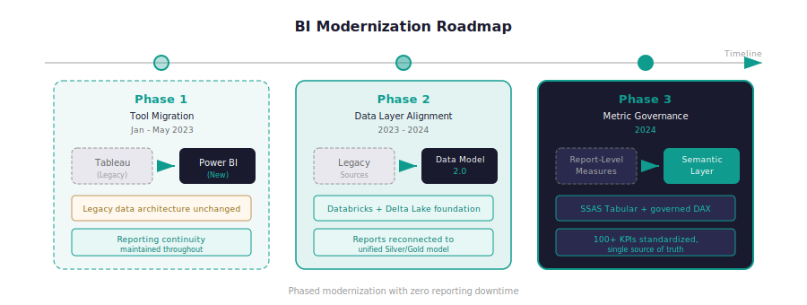

# BI Modernization Roadmap

!!! success "Outcome"
    35% reduction in report maintenance costs, 40% increase in report adoption, and zero reporting disruption across 3 migration phases.

*From fragmented Tableau reports on legacy architecture → governed semantic-layer reporting with zero disruption across 3 migration phases.*

!!! abstract "Case Study Summary"
    **Organization**: Shahid (MBC Group)
    **Role**: BI & Analytics
    **Timeline**: August 2022 – March 2023 (phases 1–2); continued through semantic-layer transition (phase 3, May 2023 – May 2024)
    **Industry**: Media & Entertainment — Analytics
    **Ownership**: Program coordinator across migration phases; direct ownership of phase 3 (semantic-layer alignment)

    **Constraints**: Migration had to run in parallel with live reporting — no downtime or data freeze permitted; Data Model 2.0 rollout was happening simultaneously, requiring coordination between data engineering and BI workstreams; report owners had varying levels of technical proficiency, requiring enablement alongside technical migration.

    **Impact Metrics**:

    - **3 migration phases completed** with zero reporting disruption: tool transition (Tableau → Power BI), data layer alignment (legacy → Data Model 2.0), metric governance (report-level logic → centralized semantic layer)
    - Migrated reporting workloads from **Tableau + legacy data sources** to **Power BI + Databricks Gold layer** — modernizing both the presentation and the underlying architecture in a coordinated sequence
    - Phase 3 semantic-layer transition: report-level DAX logic consolidated into **100+ shared measures** — eliminating duplicated metric definitions across individual report files
    - **Report maintenance burden reduced** significantly after phase 3: updates to KPI definitions now require changes in one place rather than across every report file
    - Enablement sessions delivered to reporting teams across all 3 phases — maintaining productivity during each transition
    - **35% reduction in report maintenance costs** through automation and centralized governance
    - **40% increase in report adoption** among business users through tailored departmental KPI dashboards

    *Verification: Report availability tracked throughout migration; metric consolidation measured by count of reports migrated to semantic layer consumption vs. local data model.*

This was not a single tool migration. It was a structured modernization in three coordinated phases that aligned BI tooling, data architecture, and reporting governance — while keeping reporting live throughout.

## Challenge

- **Legacy stack dependency**: Reporting was heavily coupled to Tableau and older data architecture that was being phased out
- **Architecture transition overlap**: The tool migration had to proceed in parallel with the Data Model 2.0 rollout — requiring careful sequencing to avoid double-rework
- **Consistency risk**: Reports rebuilt at different times and by different people risked drifting in logic if not managed against a fixed target architecture
- **Adoption risk**: Teams needed continuity — a disrupted reporting experience during migration would erode trust in the new platform

## Approach

**Key decision made along the way:**

> **Decision — Three sequential phases rather than a single simultaneous migration**
> *Problem*: Migrating tool, data layer, and metric logic simultaneously is high-risk — each dimension introduces its own failure modes.
> *Options*: Full stack swap in one phase (fast but high-risk); three separate sequential phases (slower but each phase is independently verifiable).
> *Chosen*: Three sequential phases with independent validation gates at each stage.
> *Why*: Separating tool migration from data layer migration from metric governance allowed each phase to be tested and validated independently. If something broke, the blast radius was contained to one layer. It also allowed reporting teams to adapt incrementally rather than absorbing three simultaneous changes.

- **Phase 1**: Migrated all active Tableau reports to Power BI — maintaining equivalence against legacy data sources; delivered training and support to report owners
- **Phase 2**: Migrated Power BI reports from legacy data sources to Data Model 2.0 (Databricks Gold layer) — standardizing on the new data architecture with validated measure equivalence
- **Phase 3**: Migrated report-level logic to centralized semantic layer measures — removing duplicated DAX from individual report files and replacing with shared, governed measure references
- Coordinated cutover sequencing, ownership assignment, and stakeholder communication across all three phases
- Ran enablement and Q&A sessions at each phase to keep reporting teams productive during transitions

## Architecture Overview

<figure markdown>
  { .diagram-embed }
  <figcaption>Three-phase modernization: tool migration (Tableau → Power BI), data layer alignment (legacy sources → Data Model 2.0), and metric governance (report-level DAX → centralized semantic layer)</figcaption>
</figure>

## Results & Impact

- **What changed in operations**: Reporting teams moved through three significant architectural changes without a reporting outage — maintaining business continuity throughout a complex, multi-month transformation
- **What changed in governance**: By end of phase 3, KPI definitions lived in one governed semantic layer rather than scattered across individual Power BI files — reducing the risk of metric drift with each new report or update
- **Maintenance overhead**: Changes to a shared KPI definition now propagate to all connected reports automatically — a significant reduction in the update-and-verify cycle that previously required touching each report file individually
- **Foundation for future work**: The completed modernization enabled all subsequent analytics, ML, and AI work to build on a clean, shared foundation

## Tech Stack

- **Reporting**: Tableau (legacy), Power BI
- **Semantic layer**: SSAS Tabular, DAX
- **Data platform**: Databricks (Gold layer), SQL Server
- **Access management**: Azure Active Directory
- **Source systems**: Youbora, Evergent, Google Ad Manager

## Reusable Pattern

This phased modernization pattern — tool transition → data layer alignment → metric governance — applies to any organization upgrading analytics platforms:

- **Phase 1**: Tool transition with continuity (migrate reports, maintain equivalence)
- **Phase 2**: Data-layer alignment (point existing reports at new architecture)
- **Phase 3**: Metric governance standardization (consolidate logic into shared layer)

The sequence reduces delivery risk and avoids big-bang migration failures. Each phase is independently testable and reversible.

**When this pattern is NOT appropriate**: If your BI estate is small (fewer than 10–15 active reports), the overhead of a phased program isn't justified — a direct migration is faster. Similarly, if your organization is early-stage with no established reporting processes, building the governed architecture directly is preferable to migrating from a legacy one.

---

## Related Projects

[Semantic Layer & KPI Framework](semantic-layer.md) · [Enterprise Data Model](data-model.md)

---

-   :material-swap-horizontal:{ .lg .middle } **Solving the same problem in your organisation?**

    ---

    BI migrations fail when tool changes, data layer changes, and metric governance changes happen simultaneously without a clear sequencing strategy. If you're planning a platform modernization and want to avoid the common failure modes, happy to share what worked and what to watch out for.

    [Let's talk about a project](https://mail.google.com/mail/?view=cm&fs=1&to=saamir259@gmail.com&su=Project%20inquiry%3A%20BI%20modernization%20%2F%20migration&body=Hi%20Syed%2C%0A%0AI%20saw%20your%20BI%20Modernization%20case%20study.%20We%27re%20dealing%20with%20%5Bproblem%5D%20and%20I%27d%20like%20to%20discuss%20%5Bapproach%5D.%0A%0ATimeline%3A%20%5Bx%5D){ target=_blank rel=noopener .md-button .md-button--primary }

