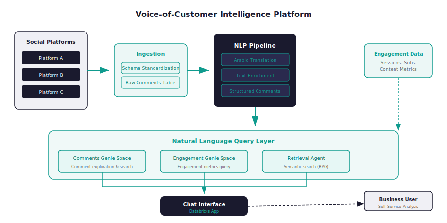

# Voice-of-Customer Intelligence Platform

!!! success "Outcome"
    Time to access audience sentiment reduced from hours of manual analysis to seconds via natural language query, with 4 social sources unified into a single intelligence platform.

*From fragmented social noise → structured, searchable audience intelligence with natural language Q&A.*

!!! abstract "Case Study Summary"
    **Organization**: Shahid (MBC Group)
    **Role**: AI Automation & Advanced Analytics
    **Timeline**: 2024–2025
    **Industry**: Media & Entertainment — AI / NLP
    **Ownership**: Key contributor to system design and implementation; contributed to ingestion pipelines, Genie space configuration, and agent routing logic

    **Constraints**: Multilingual content (Arabic/English) with no off-the-shelf translation pipeline; confidentiality requirements prevented use of third-party LLM APIs for raw comment data; tight SLA requirement (insights available by 12PM daily) driven by content team's morning review cycle.

    **Impact Metrics**:

    - Unified **4 social/platform sources** (Twitter, Facebook, YouTube, platform Shorts) into a single queryable model — previously tracked in separate exports with no cross-source analysis
    - Reduced time to access audience sentiment from **hours of manual analysis to seconds** via natural language query
    - **5 NLP enrichments** applied at ingestion: translation, sentiment, profanity detection, URL→title mapping, platform normalization — eliminating ad hoc per-platform prep work
    - Daily pipeline SLAs met: raw ingestion pre-10AM, enriched data available <1hr after ingestion, vector index rebuilt pre-12PM
    - Deployed **2 Genie spaces** + 1 LangGraph Supervisor Agent — enabling non-technical teams to query engagement KPIs and comment themes without SQL dependency

    *Verification: Pipeline SLAs tracked via Databricks Jobs monitoring; query adoption measured through app session logs.*

Social feedback existed at scale but remained difficult to analyze consistently — scattered across platforms, mostly in Arabic, and requiring analyst effort to surface any pattern.

## Challenge

- **Fragmented inputs**: Comments arrived from 4 platforms with incompatible schemas and no unified identifier
- **Language barrier**: The majority of content was in Arabic, limiting analysis for part of the leadership team
- **Manual analysis overhead**: Collection, translation, and tagging were performed ad hoc — not scalable as content volume grew
- **No self-service**: Business users had to wait on analysts for any audience insight question

## Approach

**Key decisions made along the way:**

> **Decision 1 — FAISS over managed vector DB**
> *Options*: Databricks Vector Search (managed), FAISS index in Unity Catalog Volumes (self-managed).
> *Chosen*: FAISS in Unity Catalog Volumes.
> *Why*: Managed vector search added cost and latency overhead not justified by query volume. FAISS on a daily rebuild cycle met the SLA at significantly lower cost, with Unity Catalog providing lineage and access control.

> **Decision 2 — Two specialized Genie spaces over one general space**
> *Options*: Single Genie space covering all domains; separate Engagement and Comments spaces.
> *Chosen*: Two specialized Genie spaces.
> *Why*: LLM-to-SQL reliability degrades significantly when a single space covers divergent schemas and query intent. Splitting by domain (engagement KPIs vs. comment semantics) improved query accuracy and reduced hallucination risk.

- Built Bronze → Silver → Semantic (Gold) ingestion pipelines for all 4 social sources with standardized schemas
- Implemented 5-stage NLP enrichment pipeline: Arabic→English translation, sentiment scoring, profanity detection, URL extraction→content title tagging, platform normalization
- Created two Genie spaces (Engagement and Comments) for reliable LLM-to-SQL across different query intents
- Built a LangGraph Supervisor Agent orchestrating quantitative (Genie), qualitative (RAG retrieval), and routing tools
- Delivered a Databricks App (React + FastAPI) with three query modes: Title Chat, General Chat, and Custom Post Research
- Productionized end-to-end via GitLab CI/CD with scheduled jobs, secrets management, and model serving endpoints

## Architecture Overview

<figure markdown>
  { .diagram-embed }
  <figcaption>Social comments flow through a 3-layer pipeline (Bronze → Silver NLP → Gold Semantic) into three query interfaces (Comments Genie, Engagement Genie, Retrieval Agent) orchestrated by a Supervisor Agent and accessed via a unified Databricks App</figcaption>
</figure>

## Results & Impact

- **What changed in operations**: Audience insight workflows that previously took hours of analyst time now execute in seconds via natural language query — available daily before the content team's morning review
- **What changed in decisions**: Product and content teams can now ask "what are audiences saying about [title]?" and get structured sentiment breakdowns across platforms and languages, without a data request
- **Cross-source analysis unlocked**: For the first time, comment volume, sentiment, and engagement trends could be compared across Twitter, Facebook, YouTube, and Shorts in a single interface
- **Reduced SQL dependency**: Two Genie spaces (Engagement + Comments) provide self-service analytics for non-technical stakeholders — reducing ad hoc analyst query requests

## Tech Stack

- **Orchestration**: Databricks Jobs, GitLab CI/CD
- **Processing**: PySpark, Python, Delta Lake (Bronze/Silver/Gold)
- **NLP**: Translation models, sentiment classifiers, profanity detection
- **Retrieval**: FAISS vector index in Unity Catalog Volumes
- **Agents**: Databricks Genie (×2), LangGraph Supervisor Agent
- **Application**: Databricks Apps (React + FastAPI), Model Serving endpoints

## Reusable Pattern

This platform pattern — multi-source ingestion → NLP enrichment → unified semantic layer → natural language query — is transferable to any organization with high-volume unstructured feedback:

- **Retail**: Product and brand sentiment across review platforms and social channels
- **Hospitality**: Multi-channel service feedback monitoring with multilingual support
- **Financial services**: Customer perception and complaint intelligence from social and community forums
- **Healthcare**: Patient and community feedback analysis across platforms

**When this pattern is NOT appropriate**: If your feedback volume is low (< a few thousand records/day) or your team already has a structured NLP pipeline, a simpler approach (direct Genie space over existing tables, or a single RAG endpoint) will suffice. The full Bronze→Silver→Gold stack adds meaningful value only when source schemas diverge significantly and daily freshness at scale is required.

---

## Related

**Related Projects**: [CRM Campaign Automation Platform](jarvis.md) · [Enterprise Data Model](data-model.md)

**Related Posts**: [Enigma: Voice-of-Customer Intelligence](../blog/posts/enigma-voice-of-customer-intelligence.md)

---

-   :material-comment-text:{ .lg .middle } **Solving the same problem in your organisation?**

    ---

    If your team has high-volume unstructured feedback — social comments, reviews, support tickets — and no practical way to surface patterns from it, this is the conversation to have. Multilingual pipelines, RAG retrieval, and Genie-based self-service are all transferable.

    [Let's talk about a project](https://mail.google.com/mail/?view=cm&fs=1&to=saamir259@gmail.com&su=Project%20inquiry%3A%20Voice-of-Customer%20%2F%20NLP%20pipeline&body=Hi%20Syed%2C%0A%0AI%20saw%20your%20Enigma%20case%20study.%20We%27re%20dealing%20with%20%5Bproblem%5D%20and%20I%27d%20like%20to%20discuss%20%5Bapproach%5D.%0A%0ATimeline%3A%20%5Bx%5D){ target=_blank rel=noopener .md-button .md-button--primary }

