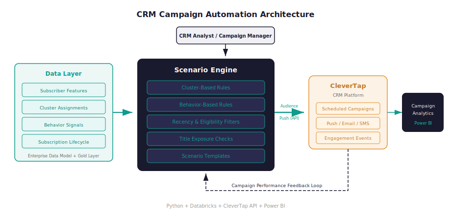

# CRM Campaign Automation Platform

!!! success "Outcome"
    Millions of profiles processed daily across 4 recommendation scenarios, replacing multi-day manual audience builds with daily automated execution.

*From manual analyst handoffs for every campaign → automated daily recommendation engine processing millions of profiles across 4 scenarios.*

!!! abstract "Case Study Summary"
    **Organization**: Shahid (MBC Group)
    **Role**: Data Science & Advanced Analytics
    **Timeline**: 2024–2025
    **Industry**: Media & Entertainment — Marketing Automation / CRM
    **Ownership**: Key contributor to scenario logic, pipeline architecture, and CRM integration; worked within the data science and engineering team

    **Constraints**: CleverTap's API targets accounts (not individual profiles), creating a mismatch with profile-level viewing behavior in multi-profile households. Required daily batch completion before CRM send schedules. Seasonal events (Ramadan) required content-filter overrides without redeployment.

    **Impact Metrics**:

    - **Millions of adult profiles** processed daily across 4 recommendation scenarios — previously required manual audience builds per campaign
    - **4 targeting scenarios** running in parallel (Clustered, Episodes Remaining, Ranked Up, AVOD) replacing a single undifferentiated blast approach
    - **7 regional segments** supported with region-specific trending logic — previously MENA-wide targeting with no regional differentiation
    - **60-day deduplication window** prevents notification fatigue: same content not re-recommended within 60 days per profile
    - Seasonal content overrides (e.g., Ramadan filter) activate and deactivate automatically on configured dates — **zero code changes or deployments** required
    - Campaign audience build time reduced from **multi-day analyst requests to daily automated execution**

    *Verification: Pipeline run logs in Databricks Jobs; recommendation volume tracked per scenario in output tables; deduplication compliance verified via `infra_sent_content` table audit.*

Campaign operations relied on manual coordination. CRM teams depended on data analysts to build audiences and schedule recurring pushes — creating a bottleneck that limited campaign frequency and consistency.

## Challenge

- **Manual setup bottleneck**: Every audience build required a data request and query turnaround — slowing campaign cadence
- **No profile-level personalization**: CRM targeting was account-level, ignoring the multi-profile structure of subscriber households
- **Execution fragmentation**: Scheduling, deduplication, and delivery were handled ad hoc with no systematic tracking
- **No feedback loop**: Campaign setup and outcome analysis lived in separate workflows with no connection between targeting logic and performance results

## Approach

**Key decisions made along the way:**

> **Decision 1 — Profile-level processing with account-level rollup**
> *Problem*: CleverTap can only target at the account level (one `gigya_id` per household), but processing at account level loses personalization in multi-profile households.
> *Options*: Process at account level (simple but imprecise); process at profile level and roll up (complex but accurate).
> *Chosen*: Profile-level processing with configurable account-level rollup (primary profile = profile with highest watch hours).
> *Why*: Preserves per-profile viewing behavior for recommendation logic while meeting CleverTap's delivery constraint. The rollup method is configurable (primary, dominant, last-active) to adapt to campaign intent.

> **Decision 2 — Behavior-based scenario prioritization over calendar rotation**
> *Problem*: Each account receives recommendations from multiple scenarios — which one to send?
> *Options*: Fixed calendar rotation (predictable); behavior-based prioritization by recency.
> *Chosen*: Behavior-based mode as default (calendar rotation available as fallback).
> *Why*: Users active in the last 7 days are best served by "Episodes Remaining" (re-engagement); users inactive 8–30 days by trending discovery; users inactive 30+ days by cluster-based discovery. Matching scenario to recency segment produces more relevant recommendations than arbitrary rotation.

- Built 3-phase shared data preparation: content metadata rollup (episode → season → show), profile-to-region mapping (7 regions), eligible profile filtering (adult + active only)
- Implemented 4 parallel recommendation scenarios, each following a 9-step pipeline: load → filter → join eligible profiles → apply content/category filters → exclude watched → exclude recently sent → rank (top 5 per profile) → write → validate
- Built account rollup (phase 3): union all scenario outputs, select one profile per account, add CRM delivery identifier
- Implemented scenario selector (phase 4): RFPT-based SVOD/AVOD split → behavior-based prioritization by days-since-last-play → one title per account
- Built temporal configuration system: seasonal overrides (Ramadan content filter) activate/deactivate automatically by date — no code changes or redeployments required
- Integrated CRM payload phase with deduplication tracking: 60-day lookback prevents repeat recommendations

## Architecture Overview

<figure markdown>
  { .diagram-embed }
  <figcaption>5-phase daily pipeline: shared data prep feeds 4 parallel scenario generators (Clustered, Episodes Remaining, Ranked Up, AVOD), which roll up to account level, pass through scenario selection, and deliver to CleverTap with 60-day deduplication</figcaption>
</figure>

## Results & Impact

- **What changed in operations**: Campaign audience creation moved from multi-day analyst handoff cycles to daily automated execution — CRM teams no longer raise data requests to run recurring campaigns
- **What changed in decisions**: Targeting shifted from undifferentiated blasts to behavior-segmented scenarios (recency-based routing, regional trending, cluster-based discovery) — giving CRM teams control over scenario logic through configuration rather than code
- **Operational reliability**: Temporal configuration handles seasonal events (Ramadan content filters) automatically — no emergency deployments or manual overrides needed during peak content periods
- **Deduplication at scale**: 60-day content tracking per profile prevents notification fatigue — the same title will not be recommended to the same profile within 60 days, regardless of which scenario generates it

## Tech Stack

- **Platform**: Databricks on AWS (PySpark + Spark SQL)
- **Storage**: Delta Lake (S3) — ACID transactions on scenario output and infra tables
- **Orchestration**: Databricks Jobs (daily batch scheduler)
- **Delivery**: CleverTap API (push notification targeting)
- **Reporting**: Power BI (campaign performance tracking)
- **Environments**: Development → Production promotion via Databricks workspace environments

## Reusable Pattern

This decision-driven recommendation-to-activation pattern — profile segmentation → scenario generation → account rollup → behavior-based selection → CRM delivery with deduplication — applies to any subscription or engagement-driven product:

- **E-commerce**: Personalized promotions, cart recovery, and lifecycle messaging with purchase-recency segmentation
- **SaaS**: Onboarding nudges, feature adoption, and retention campaigns based on product usage signals
- **Fintech**: Product nudges, payment reminders, and risk communications with eligibility-based routing
- **Telecom**: Subscriber lifecycle campaigns and upgrade recommendations with regional variation

**When this pattern is NOT appropriate**: If your user base is small enough that campaigns can be configured manually without bottleneck (<10k users, infrequent sends), the infrastructure overhead is not justified. Similarly, if your CRM platform natively supports behavioral segmentation logic, building a separate scenario layer duplicates capability rather than filling a gap.

---

## Related

**Related Projects**: [Voice-of-Customer Intelligence Platform](enigma.md) · [Enterprise Data Model](data-model.md) · [Profile-Level Feature Store](profile-features.md)

---

-   :material-robot:{ .lg .middle } **Solving the same problem in your organisation?**

    ---

    If your CRM team still depends on analyst handoffs to build audiences and run campaigns — or if your current targeting doesn't account for profile-level behavior — a scenario-based automation layer can change that. Happy to walk through the approach and what it would take in your environment.

    [Let's talk about a project](https://mail.google.com/mail/?view=cm&fs=1&to=saamir259@gmail.com&su=Project%20inquiry%3A%20CRM%20automation%20%2F%20recommendation%20engine&body=Hi%20Syed%2C%0A%0AI%20saw%20your%20Jarvis%20case%20study.%20We%27re%20dealing%20with%20%5Bproblem%5D%20and%20I%27d%20like%20to%20discuss%20%5Bapproach%5D.%0A%0ATimeline%3A%20%5Bx%5D){ target=_blank rel=noopener .md-button .md-button--primary }

