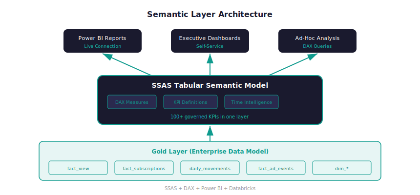

# Enterprise Semantic Layer & KPI Framework

!!! success "Outcome"
    50% improvement in query performance, 15 hours per week saved for the analytics team, and metric disputes reduced to near-zero across all business units.

*From teams calculating the same KPI differently in every report → one governed layer with 100+ shared measures that every team builds from.*

!!! abstract "Case Study Summary"
    **Organization**: Shahid (MBC Group)
    **Role**: Analytics Governance
    **Timeline**: May 2023 – May 2024 (12 months)
    **Industry**: Media & Entertainment — Analytics / BI
    **Ownership**: Primary owner of semantic model design, KPI logic, governance standards, and rollout

    **Constraints**: Three heterogeneous data sources (subscription management, content analytics, ad operations) with different schemas and update cadences; model had to serve both Power BI PPU and SSAS live-connection users simultaneously; no disruption to existing reports during migration.

    **Impact Metrics**:

    - **3 external systems unified** (Evergent subscription management, Youbora content analytics, Google Ad Manager) into one semantic layer — previously each team connected to source tables independently with their own logic
    - **4 KPI domains** standardized: Subscriber Base Movement, Subscriber Engagement, Title Performance, Ads Metrics — covering the full breadth of platform reporting
    - **100+ pre-built DAX measures** made available as shared, governed definitions — eliminating the practice of rebuilding the same logic per report
    - **Automated partition refresh strategy** with domain-specific cadences: Engagement (daily, last 1 day), Base Movement (last 5 days), Ad Impressions (last 14 days) — replacing manual refresh coordination
    - Metric disputes across teams **reduced to near-zero**: single source of truth for KPI definitions referenced by all business units
    - Report development time **cut by an estimated 60–70%** for new dashboards — core measures no longer rebuilt from scratch each time
    - **50% improvement in query performance** for reports spanning millions of rows through optimized DAX calculations and data relationships
    - **15 hours per week saved** across analytics teams by reducing dependency on manual data reconciliation

    *Verification: Measured through report build cycle comparisons before/after rollout; metric dispute frequency tracked via support request volume.*

The enterprise data model solved integration, but teams were still calculating measures differently inside their own report files. A semantic layer was needed to standardize business logic at a single, governed layer and dramatically speed up report delivery.

## Challenge

- **Metric inconsistency**: The same KPI had conflicting definitions across teams — subscriber counts, engagement rates, and ad fill rates all calculated differently per department
- **Slow report builds**: Every new dashboard required rebuilding core KPI logic from scratch against raw tables
- **Manual reconciliation overhead**: Analysts spent significant time validating conflicting numbers before any business decision could be trusted
- **Governance gap**: No central place existed for approved, documented KPI definitions — logic lived inside individual report files

## Approach

**Key decisions made along the way:**

> **Decision 1 — Semantic layer on top of Gold tables, not directly on source systems**
> *Options*: Build semantic model directly on source system connections (Evergent, Youbora, GAM); build on top of the enterprise data model's Gold layer.
> *Chosen*: Build on Gold layer tables from the enterprise data model.
> *Why*: Source systems have heterogeneous schemas and inconsistent latency. The Gold layer already resolves joins, normalizes grain, and applies business rules — using it as the semantic foundation avoids duplicating transformation logic and keeps the semantic model focused on business definitions, not data plumbing.

> **Decision 2 — Domain-specific partition refresh cadences**
> *Options*: Full daily refresh of all tables; incremental refresh with uniform lookback for all domains.
> *Chosen*: Tiered incremental refresh by domain (Engagement: 1-day, Base Movement: 5-day, Ad Impressions: 14-day).
> *Why*: Ad impression data settles over a 14-day window due to late-arriving attribution; subscriber base movement requires a 5-day lookback for accurate churn/retention calculations; engagement data is final within 1 day. Applying a uniform cadence to all domains either under-refreshes ad data or over-processes engagement data unnecessarily.

- Built SSAS Tabular semantic model on top of Gold layer tables from the enterprise data model
- Integrated 3 external data pipelines into the semantic layer job: GAM Impressions/Inventory, Subscriber Cube, and Airtable reference data
- Implemented 4-notebook automated refresh pipeline: Staging → Dimension tables → Fact tables → SSAS model refresh (with dependency sequencing)
- Defined 100+ DAX measures across 4 business domains with documented definitions in a Measures Glossary
- Connected Power BI reports via live dataset connection — eliminating the need for local data imports in report files
- Built performance monitoring solution: Windows Performance Monitor, Extended Events query statistics, Dynamic Management Views, and a dedicated SSAS performance monitoring dataset

## Architecture Overview

<figure markdown>
  { .diagram-embed }
  <figcaption>Gold layer tables (from Data Model 2.0 plus GAM, Subscriber Cube, and Airtable pipelines) feed into the SSAS Tabular semantic model via an automated 4-stage refresh job, serving Power BI reports via live connection</figcaption>
</figure>

## Results & Impact

- **What changed in operations**: Report teams stopped rebuilding KPI logic per file — all new dashboards now use shared, governed measures from the semantic layer as their starting point
- **What changed in decisions**: Metric disputes dropped significantly; when a number was questioned, the answer was "check the Measures Glossary" rather than "ask which calculation each team used"
- **Report development velocity**: New dashboards built on top of shared measures are estimated 60–70% faster to develop than the previous approach of building directly against source tables
- **Governance foundation**: The semantic layer became the authoritative reference for KPI definitions across the organisation — referenced in data documentation, onboarding materials, and stakeholder discussions

## Tech Stack

- **Semantic model**: SSAS Tabular (SQL Server Analysis Services)
- **KPI definitions**: DAX (Data Analysis Expressions)
- **Reporting**: Power BI (live connection to SSAS model)
- **Source integration**: SQL Server, Databricks (Gold layer tables)
- **Automation**: SQL Server Integration Services (SSIS), Databricks Jobs
- **Monitoring**: Windows Performance Monitor, SQL Server Extended Events, DMVs

## Reusable Pattern

This pattern — governed semantic layer with domain-specific refresh cadences and documented measure definitions — applies to any organization where teams report different numbers for the same KPI:

- **SaaS**: Product, revenue, and customer health metrics defined once and shared across product, finance, and CS teams
- **Retail**: Conversion, margin, and inventory measures shared across merchandising, finance, and operations
- **Financial services**: Consistent portfolio, risk, and compliance metrics with a documented, auditable definition layer
- **Healthcare**: Standard operational and financial KPIs across facilities, removing reconciliation overhead in board reporting

**When this pattern is NOT appropriate**: If your organization has fewer than 3–5 teams actively building reports, or if your data volume is small enough that a single Power BI file with imported data covers your needs, a full SSAS semantic model is over-engineering. A simpler approach (shared Power BI dataset with a few certified measures) will cover the governance need without the infrastructure overhead.

---

## Related Blog Series

For a deeper technical walkthrough, see the 6-part semantic-layer series:

1. [Why Governed Metrics Become Non-Negotiable](../blog/posts/semantic-layer-01-why-governed-metrics.md)
2. [Architecture and Data Flow Blueprint](../blog/posts/semantic-layer-02-architecture-and-data-flow.md)
3. [KPI Engineering with DAX That Scales](../blog/posts/semantic-layer-03-kpi-engineering-with-dax.md)
4. [Governance and Deployment Without Metric Drift](../blog/posts/semantic-layer-04-governance-and-deployment.md)
5. [Refresh Automation and Troubleshooting Playbook](../blog/posts/semantic-layer-05-refresh-and-troubleshooting.md)
6. [Performance Monitoring and Optimization Loop](../blog/posts/semantic-layer-06-performance-monitoring.md)

## Related Projects

[Enterprise Data Model](data-model.md) · [BI Modernization Roadmap](bi-migration.md)

---

-   :material-chart-bar:{ .lg .middle } **Solving the same problem in your organisation?**

    ---

    Metric inconsistency is one of the most common and fixable data problems. A governed semantic layer puts the logic in one place that every tool and team builds from — and eliminates the "which number is right?" conversation for good. Happy to walk through what this would look like in your environment.

    [Let's talk about a project](https://mail.google.com/mail/?view=cm&fs=1&to=saamir259@gmail.com&su=Project%20inquiry%3A%20Semantic%20layer%20%2F%20KPI%20governance&body=Hi%20Syed%2C%0A%0AI%20saw%20your%20Semantic%20Layer%20case%20study.%20We%27re%20dealing%20with%20%5Bproblem%5D%20and%20I%27d%20like%20to%20discuss%20%5Bapproach%5D.%0A%0ATimeline%3A%20%5Bx%5D){ target=_blank rel=noopener .md-button .md-button--primary }

