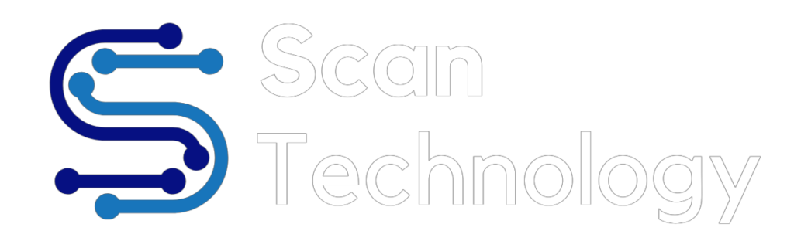

# Career Timeline

- **Current**: AI automation & advanced analytics at Shahid (MBC Group)
- **Scope**: 10+ years across analytics, BI architecture, data science, and AI automation
- **Certifications**: 3 active Databricks certifications (GenAI, ML, Data Analyst) + Azure + Tableau
- **Industries**: Media & entertainment, retail, automotive, government, enterprise consulting

Track record spans enterprise consulting (Beinex, Al-Futtaim, Scan Technology) and platform-scale product environments, with a consistent focus on translating complex data systems into measurable business outcomes.

---

## :material-layers: Skills & Technologies

<h4>Data Engineering</h4>

<h4>BI & Analytics</h4>

<h4>Programming</h4>

<h4>Data Science / ML</h4>

<h4>AI & GenAI</h4>

<strong>Focus areas:</strong> RAG, LLM integration patterns, NLP

<h4>Cloud & Tools</h4>

---

## :material-briefcase: Professional Experience

  
  

    <h3>Shahid (MBC Group)</h3>
    
Full-time · 4 yrs 1 mo

    
Dubai, UAE

  

#### Assistant Advanced Analytics and Insights Manager

Jan 2025 – Present · 1 yr 3 mos · On-site

Moved to the Data Science team to lead advanced analytics and AI automation delivery across operational use cases — spanning segmentation, inference, feature engineering, and GenAI-powered workflows.

- Shipped a GenAI-powered voice-of-customer intelligence platform unifying support, review, and social signals
- Designed and operationalised a CRM campaign automation platform, cutting manual setup time on recurring campaigns
- Delivered behavior-based attribute inference and viewing clusters feeding targeted marketing and personalization
- Built the profile-level feature store powering segmentation, inference, and GenAI use cases across teams

**Projects:** [CRM Automation](../projects/jarvis.md) · [Voice-of-Customer](../projects/enigma.md) · [Attribute Inference](../projects/gender-prediction.md) · [Feature Store](../projects/profile-features.md) · [Clustering](../projects/clustering.md) · [Additional ML](../projects/ml-contributions.md)
{: .role-projects }

#### Assistant Data and Analytics Manager

Apr 2024 – Jan 2025 · 10 mos · On-site

Continued leadership of the governed semantic layer and expanded the revenue-operations pipeline with delivery pacing and alerting.

- Migrated the governed KPI layer from Power BI Premium to SSAS Tabular to resolve memory pressure at scale
- Expanded the revenue-operations pipeline with delivery pacing, VAST error monitoring, and Slack-based alerting
- Standardised KPIs across marketing, finance, and operations through cross-functional governance reviews
- Mentored the BI and analytics team on DAX, SQL, and Power BI, raising data literacy across the organisation

**Projects:** [Semantic Layer & KPI Framework](../projects/semantic-layer.md) · [Revenue Ops Pipeline](../projects/ad-pipeline.md)
{: .role-projects }

#### Senior BI Analyst

Mar 2022 – Mar 2024 · 2 yrs 1 mo · On-site

Built the core reporting foundation spanning enterprise data modelling, BI modernisation, and semantic-layer governance.

- Designed the enterprise data model consolidating VOD, SVOD, and App subscriber data into one reporting layer
- Led the BI modernisation roadmap, migrating legacy reporting to governed Power BI and Tableau
- Built the governed semantic layer and KPI framework serving finance, marketing, and content teams
- Shipped Phase 1 of the revenue-operations pipeline covering ad delivery, performance tracking, and reconciliation

**Projects:** [Enterprise Data Model](../projects/data-model.md) · [BI Modernization](../projects/bi-migration.md) · [Semantic Layer](../projects/semantic-layer.md) · [Revenue Ops Pipeline](../projects/ad-pipeline.md)
{: .role-projects }

  
  

    <h3>Beinex</h3>
    
Full-time · 3 yrs 3 mos

    
Dubai, UAE

  

#### Senior Consultant – Analytics

Jan 2021 – Mar 2022 · 1 yr 3 mos · Dubai, UAE

Managed and delivered end-to-end analytics solutions across enterprise clients, with primary ownership of a multi-year government engagement.

- Owned the His Highness the Ruler's Court (HHRC) engagement — expanded from short-term into a multi-year delivery track
- Drove **40% increase in report utilisation** through cross-departmental Power BI workshops and enablement
- Achieved **25% reduced dependency** on analytics teams by rolling out self-service reporting patterns
- Led presales, product demos, and Proof-of-Technology engagements; set up a SharePoint onboarding portal for new consultants

**Project:** [Enterprise BI Suite](../projects/enterprise-bi-suite.md)
{: .role-projects }

#### Business Intelligence Consultant

Jan 2019 – Dec 2020 · 2 yrs · Dubai, UAE

Delivered consulting work across enterprise clients (ADIC, ADEC, Jaguar Land Rover), building BI and visualisation solutions in Tableau, Power BI, SQL, and Alteryx.

- Designed business analyses and dashboards across finance, operations, and performance reporting use cases
- Built ETL processes with SSIS, Alteryx, Tableau Prep, and SQL Server to produce clean, reusable datasets
- Delivered secure dashboards with row-level security and user-specific access controls for sensitive domains
- Trained end-users and senior stakeholders on Tableau, Power BI, and SQL to maximise BI tool adoption

**Project:** [Enterprise BI Suite](../projects/enterprise-bi-suite.md)
{: .role-projects }

  
  

    <h3>Al-Futtaim Engineering and Technologies</h3>
    
Full-time · 9 mos

    
Dubai, UAE

  

#### Business Intelligence Consultant

May 2018 – Jan 2019 · 9 mos · Dubai, UAE

Presales and implementation of data visualisation, ETL, and data-warehousing solutions for enterprise clients.

- Delivered **30% improvement in data accessibility** by consolidating multiple legacy systems into governed reporting
- Achieved **50% reduction in report generation time** by converting legacy reports to dynamic Tableau dashboards
- Led presales activities and product evaluations, using Tableau to demonstrate the value of BI solutions to clients
- Built secure, interactive dashboards with row-level security for HR, finance, and retail operations

**Project:** [Multi-Department BI Architecture](../projects/alfuttaim-bi.md)
{: .role-projects }

  
  

    <h3>Scan Technology LLC</h3>
    
Full-time · 1 yr 7 mos

    
Dubai, UAE

  

#### Business Intelligence Consultant

Oct 2016 – Apr 2018 · 1 yr 7 mos · Dubai, UAE

Delivered end-to-end BI solutions across multiple clients, with primary ownership of the Adani Group engagement and additional work with Jaguar Land Rover.

- Designed sales, financial, and performance dashboards in Tableau for near real-time executive insights
- Drove **30% improvement in decision-making speed** through interactive KPI visualisations for leadership teams
- Reduced manual reporting by **20%** using Alteryx automation for data extraction and dashboard refresh
- Conducted onsite client training on Tableau and Alteryx to help teams self-serve their BI solutions

**Projects:** [Executive KPI Dashboard Suite](../projects/jlr-dashboards.md) · [Financial & Sales Reporting](../projects/adani-reporting.md)
{: .role-projects }

  
  

    <h3>Central Motors &amp; Equipment</h3>
    
Internship · 6 mos

    
Sharjah, UAE

  

#### Intern

Feb 2016 – Jul 2016 · 6 mos · On-site

Early exposure to enterprise reporting and corporate analytics during a final-year internship with the Bosch power-tools distributor.

- Designed sales dashboards for weekly, monthly, quarterly, and yearly performance tracking
- Analysed turnover reports and conducted market analysis to inform distribution strategies for power tools
- Provided technical sales support driving new customer acquisition and retention for the dealer network

---

## :material-certificate: Certifications

### Active

### Past

Azure Data Fundamentals DP-900 (2022)
Predictive Analytics for Business - Udacity (2020)
Tableau Certified Associate Consultant (2020)
Alteryx Designer Core (2020)
Tableau Desktop Certified Associate (2019)
Tableau Desktop Specialist (2019)
Tableau Desktop Qualified Associate (2018)
Tableau Partner Sales Accreditation (2018)

---

## :material-school: Education

### BITS Pilani, Dubai Campus

**B.E. (Hons) in Engineering** | September 2012 – July 2016

Birla Institute of Technology and Science (BITS), Dubai Campus

---

-   :material-briefcase-check:{ .lg .middle } **Want to work together?**

    ---

    I'm available for project work, advisory engagements, and staff augmentation across data architecture, analytics, and AI automation. If a role or project looks like a fit, reach out directly.

    [Let's Talk](https://mail.google.com/mail/?view=cm&fs=1&to=saamir259@gmail.com&su=Let%27s%20work%20together){ .md-button .md-button--primary target=_blank rel=noopener }
    [LinkedIn :material-arrow-top-right:](https://www.linkedin.com/in/syedaamiruddin/){ .md-button target=_blank rel=noopener }

